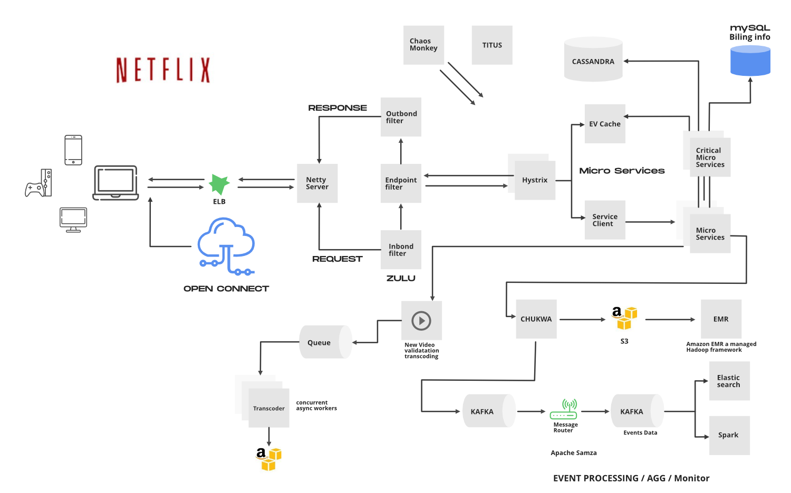

# 1. Perform a Scenario Design analysis as described below. Consider whether it makes sense for your selected recommender system to perform scenario design twice, once for the organization (e.g. Amazon.com) and once for the organization's customers.

Netflix as a company is dedicated to producing the movie experience and making sure that those producers can reach their customers.
Therefore, Netflix's target users are everyday movie watchers as well as the producers who want to get their movie on digital.
A movie watcher wants new content all the time and the producers want a seamless process that complies to the law.
As such, Netflix is responsible for making the right recommendations and in a way that respects foreign country policy and so on.
The recommendation system is responsible for overseeing both of these goals.
The recommender first filters out movies that are legal to show to their audience.
Afterwards, the recommender looks at trending movies, your favorite genres, their ratings, and so on to give your new favorite.
It is a mission critical system responsible for how well your subscription holds and to verify the value of the producer's stakes.

# 2. Attempt to reverse engineer what you can about the site, from the site interface and any available information that you can find on the Internet or elsewhere.

Shown below is a high level representation of the netflix architecture.
The recommender system used by the data scientists is the one box in the bottom right corner labeled "Apache Spark."

Netflix does two kinds of filtering called collaborative filtering and content-based filtering.
Essentially, other users will drive requests which pass through Kafka infrastructure and produce records.
For example, the banner of the movie is data driven and made based on analytics from clicks.
It is a positive feedback loop.
Then of course there is the concrete data such as its actors and its genre.
The numerical data crunching is done on Apache Spark and accessed through Elastic Search.
These reporting and feedback mechanisms produce an optimal dataset and drive Netflix's success.

# 3. Include specific recommendations about how to improve the site's recommendation capabilities going forward.

I really don't have the authority to tell a billion dollar company how to improve itself.
But if I were to entertain the idea hypothetically...
Nope, I got nothing.
Always strive to improve your algorithms where possible. 
On a personal note, the reason why I don't have Netflix is because its content filtering works too well.
None of the movies that I want to watch are available because they are either "not from my country" or "too offensive."

